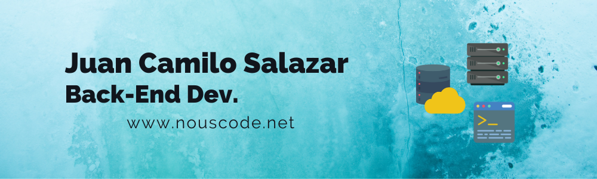

# Hey there! 🤝 Welcome...
 
## About me...
I'm a Back-End developer that have applyed JavaScript, C# and NodeJS to create apps in the Backend side with frameworks like NestJS and .NET. I program full integration web apps using development methodologies as Github, Slack, SCRUM and Kanban. Do sport is one of my hobbies, sometimes I go bike riding with friends, or do calesthenics, it helps you to focus on your main goals. 

🐉 I'm currently studing as a [Platzi](https://www.linkedin.com/school/platzi-inc/) Master student.

🔭 Right now, I am improving my soft skills.

🌱 I'm trying to learn cloud computing and Devops.

🎣 I'm looking for new horizons.

## Projects 🚂
I really enjoy investing my time in technology projects, watch how all the pieces work together, it makes me feel thrilled, programming is that I use for communicate with those pieces. I've worked with JavaScript and C#. Right now, I implement them in order to do web apps in the Backend.

Some of the projects:
- [Studio Ghibli Back Office: Manage all movies content and User's accounts from Ghibli tracker.](https://backoffice.c10-se.com/)
  - [The official repository](https://github.com/C10-Ghibli-s/BE-Backoffice)
- [Studio Ghibli Movie Tracker: Rate and Discover your favorites Ghibli's movies](https://ghibli-tracker.c10-se.com/)
  - [The official repository](https://github.com/C10-Ghibli-s/BE-Studio-Ghibli-Tracker)

- [Personal portfolio and blog website: Share blogs and your dev projects in a modern web page.](https://github.com/NousCode/personal-website)
  - [Portfolio and Blog Website](https://nouscode.net/)
- [Platzi Conf Hawaii is simple project for practice Bootstrap framework.](https://nouscode.github.io/platzi-bootstrap/)

## 🏅Technologies that I've used.

| **Programming** | **Back End**| **Front End** |
| :---: | :---: | :---: |
|    |    |    |

| **Cloud Services** | **Data Bases** | **Dev Tools** |
| :---: | :---: | :---: |
|   |    |    

## Check some of my stats

| *GitHub Stats* | *Programming Languages* |
---|---  
|  |   |

## 📡 Find me there:

- [Twitter](https://twitter.com/JuanCSpace1) where I share thinks, personal devevelopment and other things.
- [LinkedIn](https://www.linkedin.com/in/juan-camilo-salazar-be/) where I write programming post and my professional background. 
- [Instagram](https://www.instagram.com/nous_code/), where I upload my random and crazy photos.

## Resources
Write me an email or Download my CV.
- My email: <a style="margin-left: 8px;" href="mailto:nouscode@outlook.com">nouscode@outlook.com</a>
- My CV in PDF format: <a style="text-align: center;" href="https://1drv.ms/b/s!Aj66jVJPb5INdPAz1L4KebsamhE">Curriculum Vitae</a>
